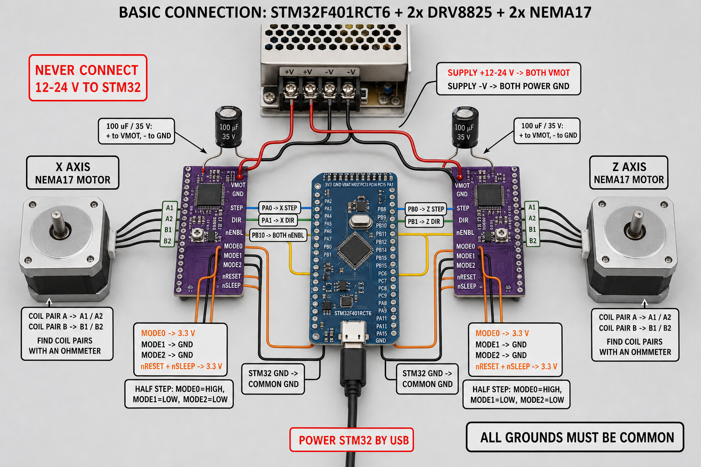

# STM32F401 X-Z laser positioning stage

This project controls a two-axis laser communication test stage using an
STM32F401RCT6, two STEP/DIR drivers (DRV8825 or TB6600), a NEMA 17 X motor and
a NEMA 23 Z motor.
The Windows GUI sends normal positions and distances in **millimetres** over a
115200-baud UART connection; exact fine jogs are entered in micrometres and sent
as integer STEP pulses.

Firmware 2.5 owns the high-resolution mechanical calibration and provides acceleration ramps,
live position reporting and a UART software E-stop. The desktop application
provides a 3D-printer-style workflow: connect, enable, set coordinate zero, jog
by exact STEP-pulse increments in micrometres, or enter an absolute X/Z target.

## Project files

- `firmware/Laser_XZ_Controller/Laser_XZ_Controller.ino` - main firmware used
  with the GUI.
- `firmware/Single_Motor_Test/Single_Motor_Test.ino` - commissioning test for X.
- `firmware/Dual_Motor_Test/Dual_Motor_Test.ino` - two-driver commissioning test.
- `gui/laser_stage_gui.py` - GUI source.
- `gui/gpib_visa.py` - optional HP E5574A VISA/GPIB interface.
- `gui/excel_beam_plotter.py` - offline importer that rebuilds beam plots from
  legacy or current session workbooks without moving the stage.
- `gui/protocol.py` - validated serial command construction and status parsing.
- `gui/test_protocol.py` - protocol unit tests.
- `dist/LaserStageController_EgSA_6400PPR_Final.exe` - final GUI matched to
  both drivers at 1/32 microstepping (6400 pulses/revolution), with session
  beam reports, the independent Excel Beam Plotter, and exact one-pulse fine
  jog controls.
- `dist/Laser_XZ_Controller_v2.5_6400PPR_F401RCT6.bin` - matched compiled
  STM32F401RCT6 firmware image for programmer-based flashing (`.hex` is also
  supplied).
- `gui/assets/` - local GUI branding assets sourced from the official EgSA
  website.
- `docs/SERIAL_PROTOCOL.md` - complete command and reply reference.
- `docs/SERIAL_TEST_GUIDE.md` - standalone UART wiring and terminal test procedure.
- `docs/TB6600_CONNECTION_GUIDE.md` - dual-TB6600 power, motor, control and
  DIP-switch commissioning guide.
- `docs/GUI_DEVELOPER_INTERFACE_SPEC.md` - full third-party GUI integration,
  motion, timing, resolution, state-machine and error-handling specification.
- `output/pdf/Laser_XZ_GUI_Developer_Interface_Specification.pdf` - polished
  handoff copy of the third-party interface specification.
- `docs/GUI_DEVELOPER_INTERFACE_SPEC.md` - complete third-party GUI integration,
  movement, speed, acceleration, resolution and error-handling specification.
- `docs/SESSIONS.md` - automated-session operation, timing, UART sequence,
  safety checks and future-recipe extension guide.
- `docs/E5574A_VISA_GUIDE.md` - host-PC VISA/GPIB setup and E5574A commands.
- `docs/BRANCHING_AND_RELEASES.md` - mandatory new-branch workflow for every
  future update and release.
- `.github/workflows/ci.yml` - automatic GUI/test and STM32 compilation checks
  for every pushed branch and pull request.

## Connections

The diagram below is for the original DRV8825 carriers. For TB6600 modules,
use [the dedicated TB6600 connection guide](docs/TB6600_CONNECTION_GUIDE.md).
Independent X and Z motion always requires **one driver per motor**.



Use the written signal labels as the authority. Identify motor coil pairs with
an ohmmeter; do not assume wire colours.

### STM32 to drivers

| STM32 signal | Connection |
|---|---|
| `PA0` | X driver `STEP` |
| `PA1` | X driver `DIR` |
| `PB0` | Z driver `STEP` |
| `PB1` | Z driver `DIR` |
| `PB10` | Shared driver-enable interface; LOW permits motion |
| `GND` | Control-interface ground; see the selected driver's guide |

These are the **only five motor-control GPIO pins used by the firmware**. It
does not configure or read PC0-PC5, PB2, limit switches or driver-fault inputs.
USART1 additionally uses PA9/PA10 only for GUI communication.

Apply these static connections to **each** DRV8825:

| DRV8825 signal | Connection |
|---|---|
| `MODE0` | 3.3 V for the commissioned 1/32 microstep mode |
| `MODE1` | GND for the commissioned 1/32 microstep mode |
| `MODE2` | 3.3 V for the commissioned 1/32 microstep mode |
| `nRESET`, `nSLEEP` | 3.3 V |
| `VMOT` | +12 V motor supply |
| Power `GND` | PSU negative/common ground |
| `A1/A2` | One measured motor coil |
| `B1/B2` | The other measured motor coil |

Install a local bulk capacitor, typically **100 uF / 35 V**, between VMOT and
GND at each carrier. Never connect or disconnect a motor while VMOT is powered.

### UART connection for the GUI

Use a USB-UART adapter with **3.3 V logic**:

| USB-UART | STM32F401RCT6 |
|---|---|
| Adapter `TX` | `PA10` / USART1 RX |
| Adapter `RX` | `PA9` / USART1 TX |
| Adapter `GND` | STM32/driver common GND |

Power the STM32 board using its normal board power input. Normally only TX, RX
and GND are connected from the UART adapter; do not connect its VCC unless the
exact controller-board power circuit requires it.

There is no hardware homing input in this version. Use **Set zero here** after
power-up. The GUI contains no Home control, and a manually typed `HOME` command
is rejected as unsupported.

## Mechanical calibration

This firmware profile requires **6400 STEP pulses per revolution** (1/32
microstepping) on both drivers. The commissioned DRV8825 wiring is `MODE0 =
3.3 V`, `MODE1 = GND`, and `MODE2 = 3.3 V`. Set the TB6600-compatible driver to
the `6400 pulse/rev` position printed on its own enclosure.

```text
pulses/mm = 6400 / mechanical travel per motor revolution in mm
```

The compiled defaults are:

| Axis | Assumed mechanism | Calibration |
|---|---|---:|
| X | 20-tooth GT2 pulley, 2 mm pitch | 160 pulses/mm = 6.25 µm/pulse |
| Z | Previous measured calibration scaled by 16× | 91.428571 pulses/mm = 10.9375 µm/pulse |

Edit these constants near the top of the main firmware if the mechanics differ:

```cpp
static const float X_STEP_PULSES_PER_MM = 160.0f;
static const float Z_STEP_PULSES_PER_MM = 91.428571f;
```

The Z value preserves the earlier successful calibration where a nominal 20 mm
command moved 35 mm. Changing 400 to 6400 pulses/revolution multiplies the
working `5.7142857 pulses/mm` value by 16. Recalibrate again after changing the
TB6600 switches. For a lead screw, use screw **lead** (travel per revolution),
not just thread pitch.

To calibrate experimentally:

1. Command 10.000 mm at low speed.
2. Measure the actual travel accurately.
3. Calculate `new calibration = old calibration x commanded / measured`.
4. Update the constant, upload again, set zero and repeat the measurement.

The exact pulse resolutions are **6.25 µm on X** and **10.9375 µm on calibrated
Z**. These values are command resolution, not guaranteed positioning accuracy.
Measure repeatability, backlash and belt compliance before assigning an
accuracy tolerance. Firmware 2.5 enforces 1-100 mm/s speed and 5-200 mm/s²
acceleration; the defaults remain 20 mm/s and 40 mm/s².

## Upload the main firmware

The dual-motor test sketch must be replaced by the main controller firmware
before the GUI can connect.

1. Install **STM32 MCU based boards 2.12.0** by STMicroelectronics in Arduino
   IDE 2. This release is compiled and continuously tested against that exact
   core version; do not silently upgrade the toolchain for a production flash.
2. Open `firmware/Laser_XZ_Controller/Laser_XZ_Controller.ino`.
3. Select **Generic STM32F4 series**.
4. Select **Generic F401RCTx** as the board part number.
5. Set **U(S)ART support** to `Enabled (no generic Serial)`.
6. Set USB support to `None`; the firmware explicitly uses USART1 on PA9/PA10.
7. Select **STM32CubeProgrammer (SWD)** and upload with ST-Link.

The firmware starts with both drivers disabled. Its successful startup message is:

```text
READY LASER_XZ 2.5
```

## Use the Windows GUI

Run:

```text
dist\LaserStageController_EgSA_6400PPR_Final.exe
```

Then follow this commissioning sequence:

1. Power the STM32 and the two motor-driver supplies.
2. Select the USB-UART COM port and click **Connect**.
3. Confirm the link badge changes to **Online** and firmware shows `2.5`.
4. Confirm the software E-stop is released and no controller fault is shown.
5. Click **Enable drivers**. Both motors should gain holding torque.
6. Click **Set zero here** for X and Z to establish the coordinate reference.
7. Select one-pulse fine jogs: `6.25 µm` for X and `10.9375 µm` for Z. Verify
   `X +`, `X -`, `Z +` and `Z -` one at a time at low speed.
8. Enter an absolute target or use the **Two-axis move** section.

The GUI includes:

- live current and target positions in mm;
- live raw STEP-pulse counts, controller calibration and µm/pulse resolution;
- independent X/Z jog and absolute controls;
- one-command relative or absolute X/Z moves;
- speed in mm/s and acceleration in mm/s^2;
- driver, motion, software E-stop and controller-fault indication;
- firmware-version handshake before motion is unlocked;
- an animated 200 x 200 mm X-Z mechanism schematic driven by live controller status;
- `Escape` as an immediate software STOP shortcut;
- separate **Motion control**, **Motion settings**, **Sessions** and
  **E5574A / GPIB** and **UART bus log** tabs;
- independent X and Z micrometre jog sliders beginning at exactly one STEP
  pulse, with editable whole-pulse values;
- a vertically scrollable Motion control workspace so X/Z absolute targets and
  coordinated controls remain reachable on smaller displays;
- a vertically scrollable Sessions workspace with mirrored stepped X and Z
  serpentine recipes, N-loop execution, live progress, pause/resume, stop and
  synchronized E5574A Head A power acquisition plus professional Excel reports
  with a configurable 100 mm beam target, X-Z power map, circular boundary,
  power centroid, radial profile and dBm heatmap;
- an independent **Excel Beam Plotter** tab that opens an existing `.xlsx`
  session report, reconstructs controller pulse positions when available and
  creates a plotted workbook copy without requiring the STM32, motors or E5574A.
  Its preview selector includes a full-scan weather heatmap, complete
  measured-point map, X/Z centerline profiles and a measured radial-average
  profile; the target circle remains visible as the analysis region;
- minimize, maximize and restore controls for the selected tab workspace;
- `Ctrl+M` to minimize a tab, `F11` to maximize it and `Ctrl+0` to restore;
- explicit `TX >` and `RX <` traffic plus a manual command console.

The serial console automatically opens whenever the controller returns `ERR`.
`TX >` is a line sent from the GUI to the STM32 and `RX <` is a line returned
by the STM32. Periodic STATUS traffic can be shown with the UART-log
checkbox. The complete traffic, including hidden periodic STATUS lines, is
always appended to:

```text
%LOCALAPPDATA%\LaserStageController\serial.log
```

The **E5574A / GPIB** tab is independent of the STM32 serial link. Install the
system VISA runtime for the connected GPIB adapter, select a resource such as
`GPIB0::24::INSTR`, connect the E5574A, then choose an application and read its
measurement. Automated sessions require this connection and record Head A
absolute power in dBm after every completed X/Z move. Each session creates a
formatted Excel workbook in the project `Session Reports` folder, available
through **Open Excel reports**. The workbook includes a position-calibrated X-Z
beam dashboard, native Excel scatter plots, a weather-style interpolated map,
X/Z and radial profiles, a complete measured dBm heatmap and the full
measurement/event audit trail. See
[the E5574A VISA guide](docs/E5574A_VISA_GUIDE.md).

`STOP` halts motion while keeping holding torque. `DISABLE` removes holding
torque and can allow a vertical stage to fall. The GUI asks for confirmation
before disabling.

## Example millimetre commands

A serial terminal at 115200 baud can also control the firmware:

```text
PING
STATUS
ENABLE
ZERO ALL
SPEED_MM X 20
ACCEL_MM X 40
MOVE_MM X 5
MOVE_MM Z -1.5
GOTO_MM X 20 Z 8
STOP
```

See [the serial protocol](docs/SERIAL_PROTOCOL.md) for all commands and status
fields, or follow [the standalone serial test guide](docs/SERIAL_TEST_GUIDE.md)
to test the STM32 without the GUI.

## Current limit and power

For TB6600 modules, use the current table printed on the exact enclosure and
follow [the TB6600 commissioning guide](docs/TB6600_CONNECTION_GUIDE.md). Begin
with a low setting; clone modules do not always use the same switch table or
the same peak/RMS convention.

The supplied motor family is rated at 2 A/phase. Many small DRV8825 carrier
boards cannot continuously dissipate enough heat for 2 A without substantial
cooling. Start around 0.5-1.0 A/phase, verify operation and temperature, then
increase only when necessary.

For a carrier using `R100` (0.10 ohm) current-sense resistors:

```text
I_CHOP = VREF / (5 x R_SENSE)
0.25 V VREF is approximately 0.5 A/phase
0.50 V VREF is approximately 1.0 A/phase
1.00 V VREF is approximately 2.0 A/phase
```

Read the actual sense-resistor markings before applying this calculation. PSU
input current is not the same as regulated motor phase current.

## Build and verification

Run the GUI from Python:

```powershell
py -m pip install -r gui\requirements.txt
py gui\laser_stage_gui.py
```

Run the protocol, GPIB, Excel-report and session tests:

```powershell
py -m unittest gui.test_protocol gui.test_gpib_visa gui.test_session_excel gui.test_excel_beam_plotter gui.test_sessions -v
```

Compile the STM32 firmware from the command line:

```powershell
arduino-cli compile --fqbn `
  "STMicroelectronics:stm32:GenF4:pnum=GENERIC_F401RCTX" `
  firmware\Laser_XZ_Controller
```

Rebuild the standalone GUI:

```powershell
$assetPath = (Resolve-Path gui\assets).Path
$iconPath = (Resolve-Path gui\assets\egsa_icon.png).Path
py -m PyInstaller --noconfirm --clean --onefile --windowed `
  --name LaserStageController_EgSA_HighResolution_6um --paths gui `
  --add-data "$assetPath;assets" --icon "$iconPath" --distpath dist `
  --workpath build\pyinstaller_egsa_high_resolution --specpath build gui\laser_stage_gui.py
```

## Safety

- Start with small jogs, low current, low speed and low acceleration.
- Fit physical hard stops to prevent travel beyond the mechanism.
- The GUI E-stop is a software control function, not safety-rated power
  isolation. A real emergency-stop circuit must independently remove motor
  energy using correctly rated hardware; it is not connected to an STM32 input
  in this version.
- Keep the laser disabled or safely terminated while commissioning movement.
- Route the laser/fibre cable through a suitable drag chain or controlled
  service loop so motion never pulls or sharply bends it.
